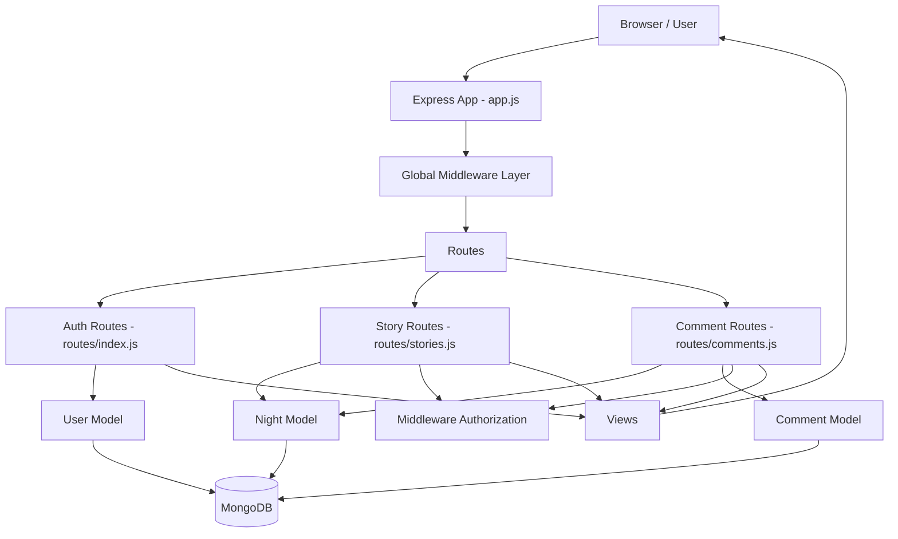
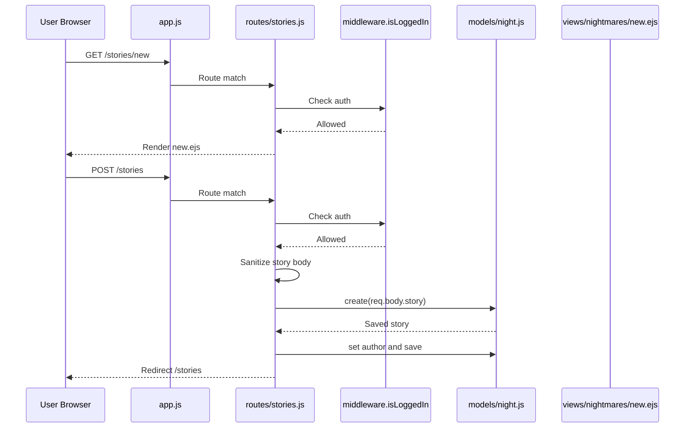
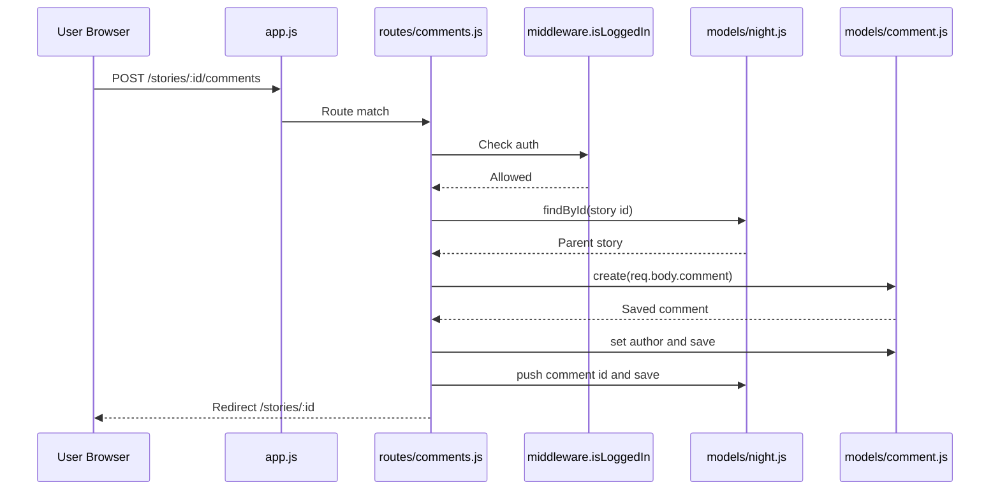
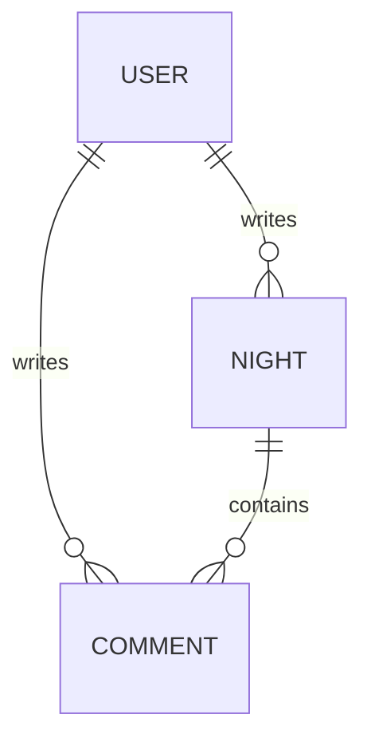

# Urban Nights Repository Understanding

## 1. Repository Overview

This repository is a server-rendered Node.js web application for a horror-story blogging platform called Urban Nightmares.

At a high level:

- `Express` handles HTTP routing and middleware.
- `EJS` renders server-side HTML pages.
- `Mongoose` models and stores users, stories, and comments in MongoDB.
- `Passport` handles local username/password authentication.
- `Middleware` centralizes access control checks.
- `Views` contain the UI templates for stories, comments, login, and signup.

The app follows a simple MVC-like structure:

- `models/` = data layer
- `routes/` = controller/request handling layer
- `views/` = presentation layer
- `middleware/` = shared authorization logic
- `public/` = static assets
- `app.js` = application bootstrap and wiring

## 2. Tech Stack and Libraries

### Core frameworks

- `Node.js`
- `Express`
- `EJS`
- `MongoDB`
- `Mongoose`

### Authentication and session libraries

- `passport`
- `passport-local`
- `passport-local-mongoose`
- `express-session`
- `connect-flash`

### Request/response utilities

- `body-parser`
- `method-override`
- `express-sanitizer`
- `compression`

### Frontend/UI libraries loaded from CDN

- `Bootstrap 4`
- `Semantic UI`
- `jQuery`
- `CKEditor 4`

### Notable package mentions

- `http-server` exists in `package.json`, but it is not used by the runtime code in this repo.

## 3. Top-Level Directory Understanding

### `app.js`

This is the main entry point and the runtime composition root.

It is responsible for:

- creating the Express app
- connecting to MongoDB
- configuring middleware
- configuring Passport authentication
- exposing `currentUser`, `error`, and `success` to all templates
- mounting all route modules
- starting the HTTP server

This file is the place where almost every major directory connects together:

- imports `models/user.js`
- imports all `routes/*`
- serves `public/`
- renders from `views/`

### `models/`

This directory defines the Mongoose schemas and database models.

Files:

- `models/user.js`
- `models/night.js`
- `models/comment.js`

Where it is used:

- `models/user.js`
  - used in `app.js` for Passport auth setup
  - used in `routes/index.js` for signup
- `models/night.js`
  - used in `routes/stories.js`
  - used in `routes/comments.js`
  - used in `middleware/index.js`
- `models/comment.js`
  - used in `routes/comments.js`
  - used in `middleware/index.js`

### `routes/`

This directory contains all HTTP route handlers.

Files:

- `routes/index.js` handles root redirect and auth routes
- `routes/stories.js` handles story CRUD
- `routes/comments.js` handles comment CRUD under stories

Where it is used:

- all three routers are imported and mounted by `app.js`

### `middleware/`

This directory contains reusable authorization checks.

Files:

- `middleware/index.js`

What it does:

- checks whether a user is authenticated
- checks whether the current user owns a story
- checks whether the current user owns a comment

Where it is used:

- imported in `routes/stories.js`
- imported in `routes/comments.js`

### `views/`

This directory contains all EJS templates rendered by route handlers.

Subdirectories:

- `views/nightmares/` for story pages
- `views/comments/` for comment forms
- `views/partials/` for shared header/footer
- root-level `views/login.ejs`
- root-level `views/signup.ejs`

Where it is used:

- rendered from `routes/index.js`
- rendered from `routes/stories.js`
- rendered from `routes/comments.js`

### `public/`

This directory contains static frontend assets.

Files:

- `public/stylesheets/app.css`

Where it is used:

- exposed globally via `app.use(express.static("public"))` in `app.js`
- loaded by `views/partials/header.ejs`

### `.vscode/`

Editor-specific settings for local development. This directory is not used by the app runtime.

### `.git/`

Git metadata. Not used by app logic.

## 4. Detailed Directory Connections

### 4.1 `app.js` as the main connector

`app.js` is the central glue layer.

Connection summary:

1. It sets up Express and global middleware.
2. It connects to MongoDB using Mongoose.
3. It configures sessions and Passport using `User`.
4. It makes auth and flash state available to every EJS view.
5. It mounts the route modules.
6. Route modules call models and render views.

### 4.2 How `routes/` connects to `models/`

- `routes/index.js` -> `models/user.js`
  - signup creates a user
  - login uses Passport with the `User` model plugin methods
- `routes/stories.js` -> `models/night.js`
  - list stories
  - create story
  - show story
  - update story
  - delete story
- `routes/comments.js` -> `models/night.js` and `models/comment.js`
  - loads the parent story
  - creates/updates/deletes comments
  - pushes comment ids into story documents

### 4.3 How `routes/` connects to `middleware/`

- story creation routes use `isLoggedIn`
- story edit/update/delete routes use `checkStoryUser`
- comment creation uses `isLoggedIn`
- comment edit/update/delete uses `checkCommentUser`

So `middleware/` is the permission gate that protects route handlers before database mutations happen.

### 4.4 How `routes/` connects to `views/`

- `routes/index.js`
  - renders `signup.ejs`
  - renders `login.ejs`
- `routes/stories.js`
  - renders `views/nightmares/index.ejs`
  - renders `views/nightmares/new.ejs`
  - renders `views/nightmares/show.ejs`
  - renders `views/nightmares/edit.ejs`
- `routes/comments.js`
  - renders `views/comments/new.ejs`
  - renders `views/comments/edit.ejs`

### 4.5 How `views/` connects back to `routes/`

Forms in the views submit back into Express routes:

- `views/signup.ejs` -> `POST /signup`
- `views/login.ejs` -> `POST /login`
- `views/nightmares/new.ejs` -> `POST /stories`
- `views/nightmares/edit.ejs` -> `PUT /stories/:id`
- `views/comments/new.ejs` -> `POST /stories/:id/comments`
- `views/comments/edit.ejs` -> `PUT /stories/:id/comments/:comment_id`
- delete forms use `?_method=DELETE`, which relies on `method-override`

This means the templates are not just for display; they are also the source of the request payload structure used by the route handlers.

## 5. File-by-File Functional Understanding

### `models/user.js`

Defines a `User` schema with:

- `username`
- `password`

It also applies `passport-local-mongoose`, which adds helper methods such as:

- `register`
- `authenticate`
- `serializeUser`
- `deserializeUser`

This model is the basis of the login and signup system.

### `models/night.js`

Defines the story model.

Fields:

- `title`
- `image`
- `body`
- `author.id`
- `author.username`
- `created`
- `comments[]`

Important relationship:

- `comments[]` stores ObjectIds referencing the `Comment` model.

This is the main content entity in the application.

### `models/comment.js`

Defines a comment with:

- `text`
- `author.id`
- `author.username`

Comments belong logically to a story, but the relationship is stored from the story side through `Night.comments`.

### `middleware/index.js`

Contains three middleware functions:

- `isLoggedIn`
- `checkStoryUser`
- `checkCommentUser`

Their role:

- stop unauthorized users before controller logic runs
- enforce ownership rules for edit/delete/update actions
- set flash messages when access is denied

### `routes/index.js`

Handles:

- `/` redirect to `/stories`
- signup page and signup submission
- login page and login submission
- logout

This file is the authentication entry point for the app.

### `routes/stories.js`

Handles the story lifecycle:

- list all stories
- show new story page
- create a story
- show one story
- show edit story page
- update a story
- delete a story

This is the main content controller in the app.

### `routes/comments.js`

Handles the comment lifecycle inside stories:

- show new comment page
- create comment under a story
- show edit comment page
- update comment
- delete comment

This file links the `Comment` model back to the `Night` model.

### `views/partials/header.ejs`

Shared UI shell:

- includes external CSS/JS libraries
- renders the top navigation
- conditionally shows auth links vs current user info
- displays flash messages

It depends on `res.locals.currentUser`, `res.locals.error`, and `res.locals.success`, which are set globally in `app.js`.

### `views/partials/footer.ejs`

Shared closing scripts and HTML. It also includes Firebase script tags, although Firebase is not used anywhere else in the repo.

### `views/nightmares/index.ejs`

Story listing page.

It expects `stories` from `routes/stories.js` and renders summary cards with title, author, date, image, and snippet.

### `views/nightmares/show.ejs`

Single story detail page.

It expects a fully loaded `story`, including populated `comments`. It also conditionally shows edit/delete controls to the story or comment owners.

### `views/nightmares/new.ejs`

Story creation form.

It submits `story[title]`, `story[image]`, and `story[body]` to `POST /stories`.

### `views/nightmares/edit.ejs`

Story editing form.

It submits to `PUT /stories/:id` using method override.

### `views/comments/new.ejs`

Comment creation form for a specific story.

### `views/comments/edit.ejs`

Comment editing form for a specific story comment pair.

### `views/login.ejs`

Login form that submits username and password to Passport local auth.

### `views/signup.ejs`

Signup form that creates a new local user account.

### `public/stylesheets/app.css`

Global styling for:

- page background
- nav styling
- delete form display
- comments block
- login/signup form layout

## 6. Request Flow Through the Entire Repo

This section answers how a user request moves through the app.

### 6.1 Generic request lifecycle

1. Browser sends request to Express.
2. `app.js` applies shared middleware:
   - static file serving
   - body parsing
   - sanitization
   - method override
   - flash
   - session
   - Passport
3. Express matches the request to a router in `routes/`.
4. Route-level middleware in `middleware/index.js` may run.
5. The route handler reads or writes MongoDB through a model in `models/`.
6. The route handler either:
   - renders an EJS template from `views/`, or
   - redirects to another route
7. The browser receives HTML or a redirect response.

### 6.2 Example flow: user signs up

1. User opens `/signup`
2. `routes/index.js` renders `views/signup.ejs`
3. User submits form to `POST /signup`
4. `routes/index.js` calls `User.register(...)`
5. Passport authenticates the new user
6. Session is established
7. Flash success message is set
8. User is redirected to `/stories`

### 6.3 Example flow: user creates a story

1. User opens `/stories/new`
2. `middleware.isLoggedIn` checks session
3. `views/nightmares/new.ejs` is rendered
4. User submits `POST /stories`
5. `middleware.isLoggedIn` runs again
6. Story body is sanitized using `req.sanitize`
7. `Night.create(...)` saves the story
8. Author id and username are copied from `req.user`
9. User is redirected to `/stories`

### 6.4 Example flow: user views one story with comments

1. User opens `/stories/:id`
2. `routes/stories.js` loads the story using `Night.findById(...)`
3. `.populate("comments")` loads referenced comment documents
4. `views/nightmares/show.ejs` renders the story and all comments
5. The page conditionally shows edit/delete controls if the current user owns the story or a comment

### 6.5 Example flow: user adds a comment

1. User opens `/stories/:id/comments/new`
2. `middleware.isLoggedIn` confirms authentication
3. `routes/comments.js` loads the parent story
4. `views/comments/new.ejs` renders the form
5. User submits `POST /stories/:id/comments`
6. Route creates a `Comment`
7. Route copies current user info into comment author fields
8. Route pushes the comment id into `night.comments`
9. User is redirected to `/stories/:id`

## 7. HLD: High-Level Architecture Diagram

## 8. LLD: Low-Level Request Flow Diagram

### Story creation flow

### Comment creation flow

## 9. Route Map

### Authentication routes

- `GET /` -> redirect to `/stories`
- `GET /signup` -> signup page
- `POST /signup` -> create user
- `GET /login` -> login page
- `POST /login` -> authenticate user
- `GET /logout` -> logout user

### Story routes

- `GET /stories` -> list all stories
- `GET /stories/new` -> new story form
- `POST /stories` -> create story
- `GET /stories/:id` -> show story details
- `GET /stories/:id/edit` -> edit form
- `PUT /stories/:id` -> update story
- `DELETE /stories/:id` -> delete story

### Comment routes

- `GET /stories/:id/comments/new` -> new comment form
- `POST /stories/:id/comments` -> create comment
- `GET /stories/:id/comments/:comment_id/edit` -> edit comment form
- `PUT /stories/:id/comments/:comment_id` -> update comment
- `DELETE /stories/:id/comments/:comment_id` -> delete comment

## 10. Data Model Relationships

### User

- can sign up and log in
- can author many stories
- can author many comments

### Night (Story)

- belongs to one author
- has many comments by storing comment ids

### Comment

- belongs logically to one story
- belongs to one author

### Relationship diagram

## 11. Important Runtime Behaviors

### Authentication state in templates

Because `app.js` sets:

- `res.locals.currentUser`
- `res.locals.error`
- `res.locals.success`

every template can:

- know whether a user is logged in
- render flash messages
- show/hide protected UI actions

### Method override behavior

HTML forms only support `GET` and `POST`, so the app uses:

- `?_method=PUT`
- `?_method=DELETE`

This is why edit/delete forms work even though browsers do not natively submit PUT/DELETE forms.

### Sanitization behavior

Story body HTML is sanitized in:

- `POST /stories`
- `PUT /stories/:id`

This is important because the story body is rendered with unescaped EJS output:

- `<%- story.body %>`

### Populate behavior

When showing a story, comments are populated before rendering. Without `.populate("comments")`, the detail page would only have comment ids instead of actual comment objects.

## 12. Notable Architectural Gaps and Observations

These are important for anyone maintaining the repo.

### Hardcoded database connection

`app.js` declares `var url = process.env.DATABASEURL;` but does not use it. Instead, MongoDB is connected using a hardcoded Atlas connection string. This makes environment-based deployment harder and exposes credentials in source code.

### Duplicate server start

`app.js` calls `app.listen(...)` twice:

- once for `127.0.0.1:3000`
- once for `process.env.PORT` and `process.env.IP`

Normally only one listener should exist. This may create unexpected runtime behavior depending on environment.

### No automated tests

`package.json` has no real test suite. Documentation and manual verification are especially important in this repo because regressions are not automatically caught.

### Story deletion does not cascade

When a story is deleted, the related comments are not deleted automatically. That can leave orphaned comment documents in MongoDB.

### Comment deletion does not remove id from story

When a comment is deleted, its ObjectId is not removed from the story’s `comments` array. This can leave stale references.

### Firebase scripts in footer

`views/partials/footer.ejs` includes Firebase scripts, but there is no Firebase integration elsewhere in the repository. This looks unused.

### Frontend libraries are CDN-driven

The app depends heavily on external CDNs for UI libraries. Local development and production rendering therefore depend on third-party availability.

## 13. Best Mental Model for New Developers

If you are new to this repo, think of it in this order:

1. `app.js` wires everything together.
2. `routes/` defines what URLs exist and what each request does.
3. `middleware/` decides whether the user is allowed to continue.
4. `models/` define what gets stored in MongoDB.
5. `views/` define what the user sees and what forms submit back to the routes.
6. `public/` styles those rendered pages.

That is the core loop of the application.

## 14. Suggested Reading Order

For someone trying to understand the library quickly, this is the best order:

1. `package.json`
2. `app.js`
3. `models/user.js`
4. `middleware/index.js`
5. `routes/index.js`
6. `models/night.js`
7. `models/comment.js`
8. `routes/stories.js`
9. `routes/comments.js`
10. `views/partials/header.ejs`
11. `views/nightmares/show.ejs`
12. remaining views
13. `public/stylesheets/app.css`

## 15. Final Summary

This repository is a small monolithic Express application with a clean and understandable structure:

- `app.js` is the bootstrapper
- `routes/` drives behavior
- `models/` drive persistence
- `middleware/` enforces auth rules
- `views/` render pages
- `public/` provides styling

The main business flow is:

- users authenticate
- authenticated users create stories
- stories can contain comments
- ownership middleware protects edits and deletes

For this repo, the most important connection to understand is:

`Browser -> app.js -> routes -> middleware -> models -> views -> Browser`

That single chain explains most of the system.
